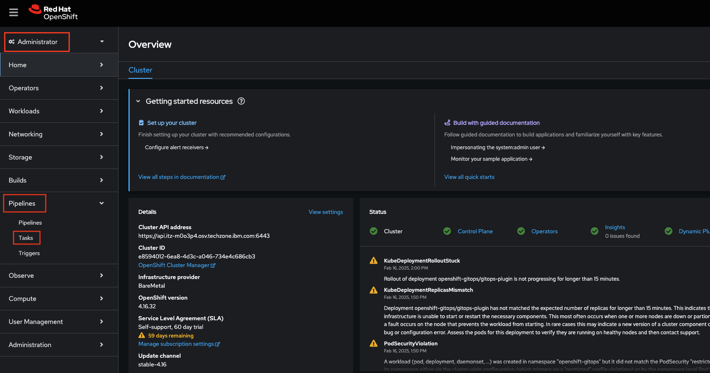
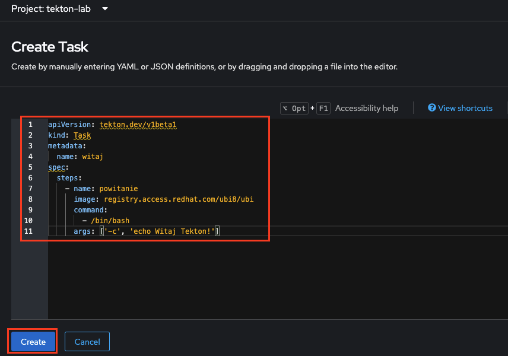
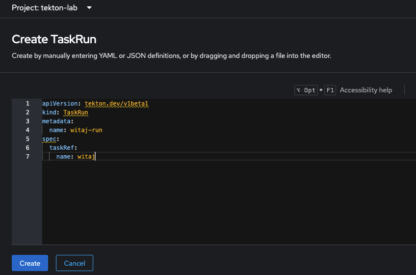
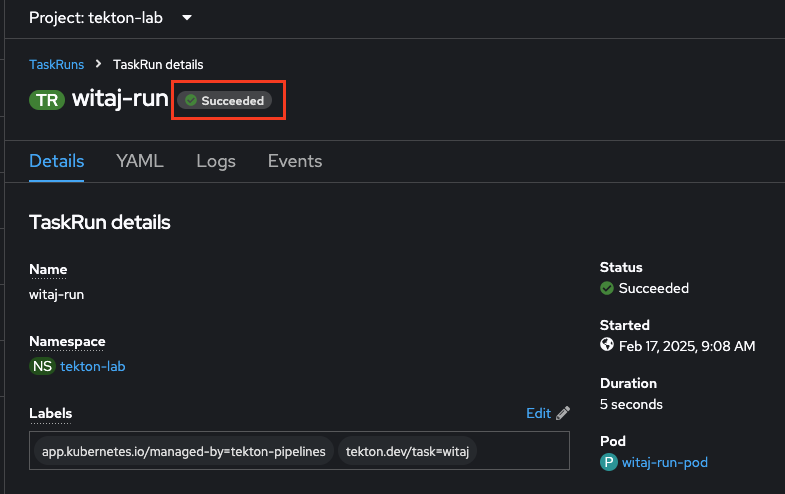
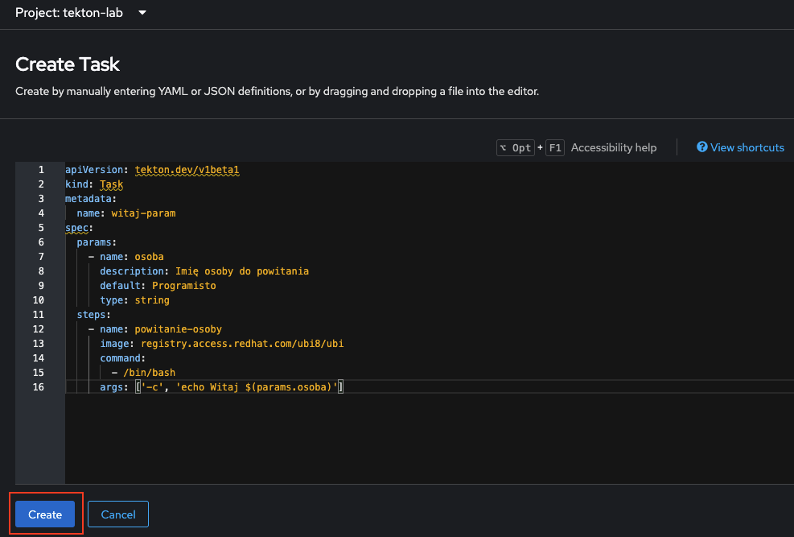
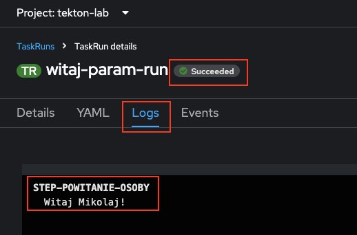
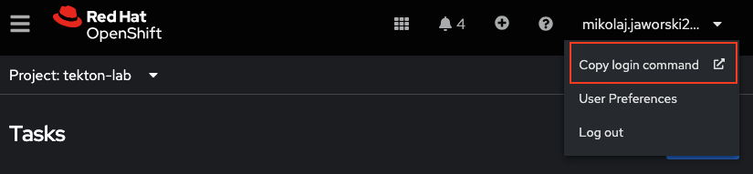
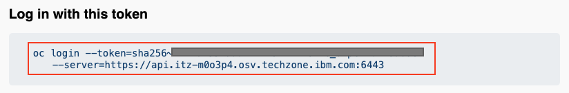

# Wstęp do Tektona

Tekton to wszechstrony, natywny dla Kubernetes framework do tworzenia systemów ciągłej integracji i dostarczania (CI/CD). W tym laboratorium dowiesz się w praktyczne, czym jest *Task*, *Pipeline* oraz *Trigger*.

## Wymagania wstępne

Aby wykonać laboratorium, nalezy:
1. Zainstalować klienta `oc` - [Instrukcja](https://docs.openshift.com/container-platform/4.16/cli_reference/openshift_cli/getting-started-cli.html)
2. Mieć dostęp do konsoli OCP - Dostęp dostarcza prowadzący.

## Tasks - Wstęp

W tym ćwiczeniu dowiesz się jak:

1. Stworzyć swój pierwsz *Task* w konsoli OCP.
2. Zainicjować i uruchmomić *Task* z wykorzystniem `TaskRun`.
2. Dodać parametr do *Task*.

*Task*, reprezentowane w interfejsie API jako obiekt typu `Task`, definiuje serię instrukcji, które są uruchamiane sekwencyjnie w celu wykonania logiki wymaganej przez *Task*. Każdy *Task* działa jako `pod` w klastrze Kubernetes, a każdy krok jest uruchamiany we własnym kontenerze.

### Stwórz swój pierwszy Task

Aby sworzyć Task, mozesz wykorzystać zarówno CLI jak i konsole OCP. W tym laboratorium przetestujesz obie opcje.

1. Aby zalogować się do konsoli otwórz swoją ulubioną przeglądarkę i wkliej adres to konsoli OCP: `lab.ocp4.example.com`.

SCREEN

2. Kliknij `lab-htpasswd`, a nastepnie zaloguj się loginem i hasłem dostarczonym przez prowadzacych. Znajdujesz się w konsoli OCP. Upewnij się, ze jesteś w panelu administracyjnym.
3. Z panelu administratora rozwiń zakładkę `Pipelines`, a następnie kliknij `Tasks`.



4. Zmień projekt na `tekton-lab-<TwojeID>`.
5. Aby stworzyć swój pierwszy *Task*, kliknij `Create`, a następnie `Task`.


6. Pojawi się okno, gdzie mozesz zdefiniować *Task*. Pierwszy Task, który stworzysz wykorzysta obraz Red Hat Universal Base Image i wykona komende `echo`, aby się "przywitać". Wklej następującą definicje do okna i kliknij `Create`.

```
apiVersion: tekton.dev/v1beta1
kind: Task
metadata:
  name: witaj
spec:
  steps:
    - name: powitanie
      image: registry.access.redhat.com/ubi8/ubi
      command:
        - /bin/bash
      args: ['-c', 'echo Witaj Tekton!']

```



Przyjrzyj się definicji powyżej. Typ obiektu to `Task`. Dalej defniujesz nazwę oraz poszczególne kroki (*Steps*) w ramach Task'u. Krok `powitanie` korzysta z obrazu UBI i wysyłają polecenie `echo` z odpowiednimi argumentami do konsoli.

### Inicjalizacja Task'u.

1. Aby zainicjalizować *Task*, nalezy stworzyć obiekt `TaskRun`. Kliknij `Creat`, a następnie `TaskRun`.


2. Pojawi się okno, gdzie mozesz zdefiniować *TaskRun*. Skopiuj definicje ponizej i wklej do konsoli OCP.

```
apiVersion: tekton.dev/v1beta1
kind: TaskRun
metadata:
  name: witaj-run
spec:
  taskRef:
    name: witaj
```



3. Zaaplikuj `TaskRun`, klikając `Create`.
4. Zostaniesz przeniesiony do zainicjalizowanego `TaskRun` w konsoli OCP. Poczekaj, az `TaskRun` zakończy prace z sukcesem.



5. Zweryfikuj wykonanie komendy `echo`, przechodzać do zakładki `Logs`.


### Wykorzystanie parametrów w Task'u

1. Wróć do pulpitu `Tasks` i stwórz nowy *Task*, klikając `Create -> Task`.
2. W oknie wklej następującą definicje zadania:

```
apiVersion: tekton.dev/v1beta1
kind: Task
metadata:
  name: witaj-param
spec:
  params:
    - name: osoba
      description: Imię osoby do powitania
      default: Programisto
      type: string
  steps:
    - name: powitanie-osoby
      image: registry.access.redhat.com/ubi8/ubi
      command:
        - /bin/bash
      args: ['-c', 'echo Witaj $(params.osoba)']
```


Bazując na naszym przykładzie `witaj`, dodałeś parametr `osoba` z domyślną wartością. Aby uzyskać dostęp do nowego parametru, nalezy wywołać go za pomocą konstrukcji `$(params.osoba)`

3. Wróc do puplitu `Tasks` i stwórz `TaskRun`, aby wywołać *Task*. Kliknij `Creat`, a następnie `TaskRun`.
4. Wklej definicje `TaskRun`:

```
apiVersion: tekton.dev/v1beta1
kind: TaskRun
metadata:
  name: witaj-param-run
spec:
  params:
    - name: osoba
      value: "<Twoje imię>"
  taskRef:
    name: witaj-param
```


5. W `TaskRun` mozesz nadpisać wartość paramentru zamieniając wartość w polu `value`. Kliknij `Create`, aby zainicjalizować wykonanie zdaania.

6. Zweryfikuj wykonanie komendy `echo` po zakończeniu zadania, przechodzać do zakładki `Logs`.



## Pipeline - Wstęp

Teraz, gdy rozumiesz już `Task'i` i parametry, przejdźmy do tworzenia `Pipeline`. Zadania (*Tasks*) są przeznaczone do pojedynczych działań, podczas gdy *Pipeline* to seria zadań, które mogą być uruchamiane równolegle lub sekwencyjnie.

W tym ćwiczeniu dowiesz się jak:

1. Stworzyć *Task* z wykorzystaniem CLI.
2. Stworzyć swój pierwsz *Pipeline* z wykorzystaniem CLI.
3. Zainicjować i uruchmomić *Pipeline* z wykorzystniem `PipelineRun`.

### Stworzyć Task z wykorzystaniem CLI

1. Stwórz folder roboczy `tekton-lab` na swojej stacji roboczej.
1. Aby stworzyć Task z wykorzystaniem CLI w pierwszej kolejności musisz stworzyć plik `yaml` z definicją obiektu. Otwórz swój ulubiony edytor tekstu i wklej definicje `Tasku`:

```
apiVersion: tekton.dev/v1beta1
kind: Task
metadata:
  name: rozmowa
spec:
  params:
    - name: powiedz
      description: Co powinienem powiedzieć?
      default: Witaj
      type: string
    - name: stop
      description: Jak długo czekać?
      default: 0
      type: string
  steps:
    - name: powiedz-to
      image: registry.access.redhat.com/ubi8/ubi
      command:
        - /bin/bash
      args: ['-c', 'sleep $(params.stop) && echo $(params.powiedz) && echo']
```



2. Przeanalizuj `Task` i zapisz go jako `rozmowa-task.yaml` w wybranym przez Ciebie folderze (`/<ściezka-do-TwójFolder>/tekton-lab`).
3. Teraz musimsz zalogować się do klastra OCP korzystając z CLI. Wróć do konsoli OCP i rozwiń nazwę swojego uzytkownika, a następnie kliknij `Copy login command`.



4. Kliknij `Display Token`. W nowym oknie pojawi się komenda do logowania do klastra z CLI. Skopiuj ją.


5. Otwórz sesję terminala (`CMD`) na swojej stacji roboczej. 
6. Zmień folder roboczy na folder, gdzie zapisałś plik `rozmowa-task.yaml`. (Win: `dir '/<ściezka-do-TwójFolder>/tekton-lab` , Linux: `cd /<ściezka-do-TwójFolder>/tekton-lab`).
7. Wklej skopiowaną komendę logowania i kliknij `Enter`.


8. Zmień projekt na `tekton-lab-<TwojeID>` wpisując komendę: `oc project tekton-lab-<TwojeID>`


9. Aby stworzyć `Task` zaaplikuj plik `yaml` komendą: `oc apply -f rozmowa-task.yaml`


### Stworzyć swój pierwsz Pipeline

1. Ponownie otwórz swój ulubiony edytor i stwórz nowy plik o nazwie `rozmowa-pipeline.yaml`.
2. Wklej definicje `Pipeline`: 

```
apiVersion: tekton.dev/v1beta1
kind: Pipeline
metadata:
  name: rozmowa-zadan
spec:
  tasks:
    - name: zadanie-pierwsze
      params:
        - name: powiedz
          value: "Cześć! Jestem pierwszy!"
        - name: stop
          value: "2"
      taskRef:
        name: rozmowa
    - name: zadanie-drugie
      params:
        - name: powiedz
          value: "Cześć Pierwszy! Jestem drugi!"
        - name: stop
          value: "2"
      taskRef:
        name: rozmowa
      runAfter:
        - zadanie-pierwsze
    - name: zadanie-trzecie
      params:
        - name: powiedz
          value: "Cześ Wszystkim! Ja jestem trzeci!"
      taskRef:
        name: rozmowa
      runAfter:
        - zadanie-drugie
```

Przyjrzyj się definicji powyżej. Typ obiektu to `Pipeline`. Dalej defniujesz nazwę, a następnie zadania (`Tasks`), które mają być wykonane. Dla poszczególnych zadań definiujesz nazwę zadania (`name`), parametry zadania (`params`) oraz definicje zadania (`taskRef`). Jeśli chcesz, aby zadania wykonywały się sekwencyjne nalezy dodać parametr `runAfter`, który definiuje po którym zadaniu ma się wykonać dany Task. Bez tego parametru zadania będą wykonywać się równolegle. 


3. Aby stworzyć `Pipeline` zaaplikuj plik `yaml` komendą: `oc apply -f rozmowa-pipeline.yaml`


4. W następnym kroku nalezy stworzyć obiekt `PipelineRun`, który analogicznie jak `TaskRun` wykonuje `Pipeline`. Otwórz edytor i stwórz nowy plik o nazwie `rozmowa-pipeline-run.yaml`.
5. Wklej definicje `PipelineRun`:

```
apiVersion: tekton.dev/v1beta1
kind: PipelineRun
metadata:
  name: rozmowa-zadan-run
spec:
  pipelineRef:
    name: rozmowa-zadan
```


6. Aby uruchomić `Pipeline` zaaplikuj plik `rozmowa-pipeline-run.yaml` komendą: `oc apply -f rozmowa-pipeline-run.yaml`


7. Aby sprawdzić logi wykonanego Pipeline'u wróć do konsoli OCP i przejdź do pulpitu `Pipelines` i kliknij `rozmowa-zadan-run`.


8. Wszystkie zadania wtkonały w odpowiedniej sekwencji i zakończyły sukcesem. Przejdź do zakładki `Logs`.


9. Przejrzyj wykonanie poszczególnych zadań.

