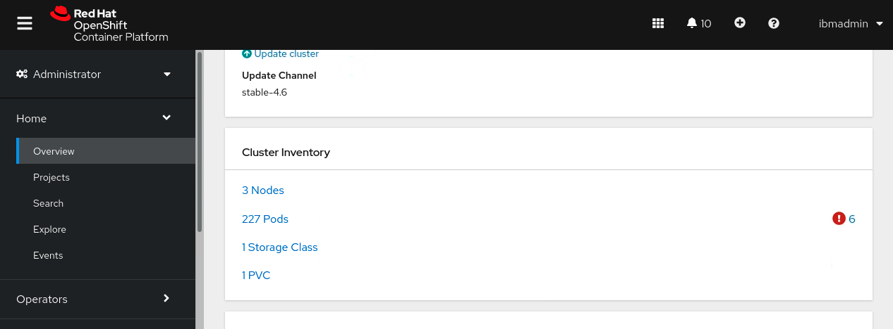

# Wstęp do konteneryzacji na OpenShift

 

**Ostatnia aktualizacja:** Marzec 2024

**Czas trwania:** 45 minut

## Wprowadzenie 

W tym laboratorium przedstawimy podstawy orkiestracji kontenerów przy wykorzystaniu OpenShift. Omówimy: 

- podstawową nawigację za pomocą konsoli webowej,
- uruchomienie przykładowego obrazu 'httpd' z konsoli webowej,
- deployment przykładowego obrazu 'httpd' z linii poleceń.

## Dostęp do środowiska

Jeśli wykonujesz to laboratorium w ramach warsztatu prowadzonego przez instruktora, środowisko zostało już dla Ciebie przygotowane. Instruktor poda szczegóły dotyczące dostępu do środowiska laboratoryjnego.

<br/>

1.  Dostań się do środowiska laboratoryjnego przez przeglądarkę internetową. 
     
    `Środowisko Laboratoryjne` jest skonfigurowany tak, aby zapewnić dostęp do maszyny wirtualnej **`Stacji roboczej`** poprzez interfejs noVNC.
    
    a. Otwórz link otrzymany przez instruktora w przeglądarce internetowej. 

    b. Kliknij na link **`Published Service`**, który wyświetli **Spis katalogów**  
    
    c. Kliknij na link **`vnc.html`**, aby otworzyć środowisko laboratoryjne poprzez interfejs **noVNC**. 
    
    

    d. Kliknij **`Connect`** 
    
      


    e. Wpisz hasło:  **`passw0rd`**. Następnie kliknij **`Send Credentials`**, aby otworzyć środowisko laboratoryjne. 

    > Uwaga: Tam jest numeryczne zero w haśle: passw0rd  

      

	 
	 <br>
	 
2.  Jeśli zostaniesz poproszony o zalogowanie się do maszyny wirtualnej `stacja robocza`, użyj poniższych danych uwierzytelniających: 

    Dane logowania do maszyny wirtualnej **`stacja robocza`** to:
 
     - User ID: **techzone**

     - Password: **IBMDem0s!**

     > Uwaga: Tam jest numeryczne zero w haśle: passw0rd

   <br>
 

	 
   <br>

<details>
 <summary><b><font color="dodgerblue">Kliknij, aby otworzyć:</font></b> Wskazówki dotyczące pracy w środowisku laboratoryjnym
 </summary>

1. Możesz zmienić rozmiar okna maszyny VM, korzystając z opcji **ustawień noVNC**. Aby dopasować rozmiar pulpitu wirtualnego do ekranu:

    a. Z poziomu środowiska VM kliknij **strzałkę** w panelu sterowania noNC, aby otworzyć menu.  

    

    b. Aby zwiększyć widoczny obszar, kliknij `Settings > Scaling Mode` i ustaw wartość na `Remote Resizing` 
      
     


2.  Tekst z ćwiczeń można kopiować i wklejać do środowiska laboratoryjnego, korzystając ze schowka w przeglądarce noVNC. 
   
    a. Skopiuj tekst z ćwieczenia, który chcesz wkleić do środowiska laboratoryjnego.
    
    b. Kliknij ikonę **`Clipboard`**, a następnie **`wklej`** tekst do schowka noVNC.

    
    
    c. Wklej tekst do maszyny wirtualnej, np. do okna terminala, okna przeglądarki itp.

    d. Kliknij na ikonę **`clipboard`**, aby zamknąć schowek.

   
3. Alternatywą dla opcji Kopiuj/Wklej noVNC jest otwarcie ćwiczeń w przeglądarce internetowej wewnątrz maszyny wirtualnej. Używając tej metody, możesz łatwo skopiować/wkleić tekst z ćwiczenia bez konieczności korzystania ze schowka noVNC. 

</details>
<br>

## Deployment przykładowego obrazu 'httpd' z poziomu web console

### Logowanie do OpenShift web console

1. Otwórz przeglądarkę Firefox na maszynie wirtualnej. 

     
 
     <br/>

2. Wybierz zakładkę **`OpenShift Console`** w lewym górnym rogu okna przeglądarki, aby uzyskać dostęp do konsoli webowej OpenShift Container Platform.

     
     
	 <br/>
	 
 
3. Zaloguj się korzystając z poniższych danych:
   
     * Username: **`ocadmin`**
     * Password: **`ibmrhocp`**

     


### Overview - Informacje ogólne

1. Kliknij kartę **`Overview`** znajdującą się pod sekcją **`Home`** w menu po lewej stronie, aby wyświetlić podsumowanie zdarzeń:

    

	 <br/>

2. Przewiń w dół, aby wyświetlić zasoby `Cluster utilization`:

    

     <br/>

3. Wyświetl informacje o zasobach klastra `Cluster inventory` na stronie Przegląd (Overview). Możesz kliknąć każdy element z listy, aby dowiedzieć się więcej:

    

    Zwróć uwagę, że:

    - **`Nodes`** reprezentują fizyczny lub wirtualny sprzęt, na którym działa Twój klaster OpenShift.
    - **`Pods`** służą do hostowania i uruchamiania jednego lub więcej kontenerów. Każdy węzeł może uruchamiać wiele podów. Kontenery w tym samym podzie współdzielą tę samą sieć i przestrzeń dyskową.
    - **`Storage classes`** (klasy pamięci masowej) reprezentują różne typy pamięci skonfigurowanej i udostępnionej klastrowi OpenShift.
    - **`Persistent Volume Claims`** (PVCs, Żądania trwałej pamięci) oznaczają wykorzystanie pamięci przez pody. Po usunięciu poda dane, które nie zostały zapisane w trwałej pamięci zostaną utracone.

### Projekty - Projects

Projekty Openshift (`projects`) umożliwiają grupowanie powiązanych zasobów oraz przypisywanie im odrębnych zasad zarządzania. 
Często artefakty związane z różnymi aplikacjami są przypisywane do różnych `projektów`. Zasoby należące do tego samego projektu są przechowywane w tej samej przestrzeni nazw (`namespace`) Kubernetes.

1. Kliknij w zakładkę **`Projects`** znajdującą się w menu **`Home`** po lewej stronie, a następnie **`Create Project`**:

    

	<br/>

2. W oknie dialogowym wpisz `myproject` jako nazwę projektu, a następnie kliknij **`Create`**:

    

	 <br/>
	 
3. Po utworzeniu kliknij każdą z kart projektu. 

   Zwróć uwagę na następujące elementy:

    - Karta `YAML` pokazuje reprezentację projektu w formacie YAML. Każdy zasób w OpenShift jest reprezentowany jako struktura danych REST. Będziemy często pracować z plikami YAML podczas interakcji z OpenShift za pomocą wiersza poleceń.
    - Zakładka `Role Bindings` (Powiązania Ról) okazuje konfiguracje zabezpieczeń przypisane do Twojego projektu. Na razie zwróć uwagę, że po utworzeniu projektu automatycznie zdefiniowanych jest wiele różnych ról. Każda z tych ról (**roles**) pełni inną funkcję i jest już przypisana do określonych użytkowników (**users**), grup (**groups**) lub kont serwisowych (**service accounts**).

   

### Pierwsza aplikacja

Typowe artefakty potrzebne do uruchomienia aplikacji w OpenShift to:
- Obraz kontenera (`container image`) zawierający Twoją aplikację, umieszczony w rejestrze kontenerów.
- Jeden lub więcej podów (`pods`), które określają, skąd pobrać obraz i jak go uruchomić.
- Wdrożenie (`deployment`), które kontroluje liczbę instancji podów. Zazwyczaj nie konfiguruje się poda bezpośrednio — zamiast tego definiuje się deployment, który zarządza zestawem podów.
- Usługa (`service`), która udostępnia aplikację w wewnętrznej sieci i umożliwia równoważenie obciążenia aplikacji w klastrze OpenShift.
- Trasa (`route`) lub `ingress`, które odpowiadają za to, że aplikacja staje się dostępna spoza zapory klastra OpenShift.

    

#### Pierwszy deployment 

1. W zakładce **`Workloads`** kliknij **`Deployments`**. Następnie wybierz **`Create Deployment`**:

    

	 <br/>

2. Zwróć uwagę, że konsola wyświetla plik YAML dla wdrożenia.

Wprowadź następujące zmiany do pliku YAML, zgodnie z opisem i ilustracją poniżej:
  a. Wpisz `'example' ` jako **'name'** (nazwę) deploymentu. Upewnij się, że zachowujesz pojedyncze cudzysłowy ', jak pokazano poniżej.
    
  b. Zmień liczbę `replicas` (replik) z 3 na **`2`** 

  c. Zmień  **'app: name'** na `app: httpd` zarówno dla 'matchLabels' jak i 'labels' 
    
  d. Kliknij przycisk **`Create`**:


Oto pełna specyfikacja wdrożenia (deployment) zgodna z wcześniej opisanymi zmianami:

    ```yaml
    apiVersion: apps/v1
    kind: Deployment
    metadata:
      namespace: myproject
      name: 'example'
    spec:
      selector:
        matchLabels:
          app: httpd
      replicas: 2
      template:
        metadata:
          labels:
            app: httpd
        spec:
          containers:
            - name: container
              image: >-
                image-registry.openshift-image-registry.svc:5000/openshift/httpd:latest
              ports:
                - containerPort: 8080
                  protocol: TCP
      strategy:
        type: RollingUpdate
        rollingUpdate:
          maxSurge: 25%
          maxUnavailable: 25%
    ```


3. Przejdźmy teraz do przeglądu tego zasobu (resource):

    - Każdy zasób w OpenShift posiada grupę, wersję i typ (kind). Dla zasobu `Deployment`:
        - Grupą jest `apps`
        - Wersja to `v1`
        - Typ to `Deployment`
    - `metadata` określa, które pody będzie obsługiwać to wdrożenie:
        - Nazwa instancji to `example`
        - Przestrzeń nazw (namespace), w której działa zasób `myproject`
        - Nie zostały jeszcze wyświetlone etykiety (labels), które zostaną użyte później
    - Sekcja `spec` określa, które pody będzie obsługiwać to wdrożenie:
        - `Selector` opisuje szczegóły `pods` które będą obsługiwać `deployment`. The `matchLabels` attribute with value `app: httpd` means this `deployment` instance will search for and manage all pods whose labels contain `app: httpd`.
    - Pole `replicas: 2` określa liczbę instancji do uruchomienia.
    - Sekcja `template` zawiera informacje w jaki sposób uruchomić kontener i utworzyć `pods`:
        - Sekcja `labels` jakie etykiety mają zostać dodane do tworzonych `pods`. Zwróć uwagę, że etykiety te pasują do etykiet zdefiniowanych w sekcji selector. `selector`.
        - Sekcja `containers` określa, skąd pobrać obraz kontenera oraz które porty mają zostać wystawione. W naszym przypadku obraz to `openshift/httpd`.
    - Sekcja `stratey` określa, w jaki sposób tworzyć, aktualizować lub przywracać różne wersje aplikacji. 
        - Strategia `RollingUpdate` jest ustawiona jako domyślna. Pozwala na aktualizację zestawu podów bez przestojów. Zastępuje pody działające na starej wersji aplikacji nowymi — jeden po drugim.
    <br/> 
 
4. Zaczekaj aż oba pody zostaną uruchomione:

    

    <br/> 


5. Kliknij w zakładkę `Pods`. 

    Zwróć uwagę, że zasoby podów są zarządzane przez kontroler przypisany do Twojego wdrożenia (`deployment`). 

    Nie tworzysz zasobów podów samodzielnie.
Dlatego zakładka `Pods` znajduje się w zasobie `deployment`, który właśnie utworzyłeś.

    

    <br/> 

6. Kliknij na jeden z podów:

    

    <br/> 

7. Przejżyj zakładki (**tabs**) dostępne dla Twojego poda.

    

    <br/> 

     - **`Detils:`** wyświetla wysokopoziomowe szczegóły dotyczące poda.
     - **`Metrics:`** wyświetla ogólne zużycie zasobów przez Twój pod. 
     wróć uwagę, że jednostką zużycia CPU jest m (mili-core), co oznacza jedną tysięczną rdzenia procesora.
     - **`YAML:`** przeanalizuj plik YAML, który opisuje Twój pod. Ten YAML został wygenerowany automatycznie przez kontroler wdrożenia (Deployment Controller) na podstawie specyfikacji, którą podałeś w definicji Deployment.
     - **`Environment:`** wyświetla zmienne środowiskowe zdefiniowane dla Twojego poda. Dla poda `httpd` nie ma żadnego.
     - **`Logs:`** wyświetla logi konsoli (console log) Twojego kontenera. 
     - **`Events:`** to typy zasobów w Kubernetes, które są automatycznie tworzone, gdy inne zasoby zmieniają stan, wystąpią błędy, lub pojawią się inne komunikaty, które powinny być przekazane systemowi.
     - **`Terminal:`** otwiera zdalną powłokę (shell) w Twoim kontenerze. Podobnie jak w laboratorium „Wprowadzenie do Dockera”, powłoka nie jest dostępna w tym obrazie kontenera. Zwiększa to bezpieczeństwo, ale jednocześnie utrudnia debugowanie.


### Pierwszy Serwis (Service)

Serwis (**`service`**) umolżliwia równoważenie obciążenia pomiędzy podami, które zostały właśnie utorzone w obrębie klastra Openshift.

1. Przewiń w dół do zakładki **`Networking`** (sieci) w lewym menu nawigacyjnym, kliknij **`Services`** (Usługi), a następnie **`Create Service`** (utwórz usługę):

    

    <br/>

2. Zaktualizuj parametry w pliku `YAML`:
    
    **(Przed aktualizacją)**
    
    
    
    a. W sekcji spec.selector: 
	
      - zmień `MyApp` na `httpd`
        W ten sposób usługa odnajdzie pody, które ma równoważyć obciążeniem. Dlatego odpowiada etykietom (`spec.selector.matchLabels`) które zostały użyte podczas tworzenia deploymentu aplikacji httpd.
   
    <br/>   
   
    b. W sekcji spec.ports:
	
      - zmień `80` na `8080` oraz 
      - zmień `9376` na `8080` (te same porty, które użyliśmy w laboratorium o klastrach).
    
	<br/>
	
	c. Kliknij `Create`

    **(Po aktualizacji)**

    

    <br/>
	
3. Po utworzeniu usługi, kliknij w zakładkę **`YAML`**:

    

    Plik YAML wygląda następująco:
    ```yaml
    kind: Service
    apiVersion: v1
    metadata:
      name: example
      namespace: myproject
      uid: d716f19c-3fbe-4917-89f3-7ea426d66494
      resourceVersion: '12721128'
      creationTimestamp: '2024-02-12T23:21:02Z'
      managedFields:
        - manager: Mozilla
          operation: Update
          apiVersion: v1
          time: '2024-02-12T23:21:02Z'
          fieldsType: FieldsV1
          fieldsV1:
            'f:spec':
              'f:internalTrafficPolicy': {}
              'f:ports':
                .: {}
                'k:{"port":8080,"protocol":"TCP"}':
                  .: {}
                  'f:port': {}
                  'f:protocol': {}
                  'f:targetPort': {}
              'f:selector': {}
              'f:sessionAffinity': {}
              'f:type': {}
    spec:
      clusterIP: 172.30.14.92
      ipFamilies:
        - IPv4
      ports:
        - protocol: TCP
          port: 8080
          targetPort: 8080
      internalTrafficPolicy: Cluster
      clusterIPs:
        - 172.30.14.92
      type: ClusterIP
      ipFamilyPolicy: SingleStack
      sessionAffinity: None
      selector:
        app: httpd
    status:
      loadBalancer: {}
    ```

4. Zwróć uwagę, że dla tej usługi została utworzona adresacja IP obowiązująca w całym klastrze (cluster-wide IP address) oraz że usługa ta jest ma load balancing.
Dodatkowo, nie ustawiono session affinity dla tej usługi.

### Pierwszy route (trasa)

Trasa (Route) udostępnia Twoje wewnętrzne punkty końcowe (endpoints) na zewnątrz klastra, omijając jego wbudowaną zaporę sieciową (firewall).

1. Kliknij zakładkę **`Route`** wewnątrz **`Networking`** w menu po lewej stronie, a następnie **`Create Route`**:

    

    <br/>

2. Podaj dane wejściowe dla następujących parametrów:

    - Name: `example`
    - Service: `example`
    - Target Port: `8080 --> 8080 (TCP)`
    - Click `Create`

    <br/>

    

    Zwróć uwagę, że na potrzeby tego laboratorium pomijamy konfigurację TLS. Kwestie związane z bezpieczeństwem zostaną omówione w innym laboratorium.
    <br/>

3. Uzyskaj dostęp do trasy (Route), klikając link podany w polu `Location` zasobu Route. Adres trasy otworzy się w nowej karcie przeglądarki.

    

    <br/>

4. Jeśli wszystko zostało poprawnie skonfigurowane, przeglądarka wyświetli stronę aplikacji, która została wdrożona w klastrze.  `Red Hat Enterprise Linux Test page`. 

  

<br/>

**Gratulacje**, właśnie uruchomiłeś swoją pierwszą aplikację korzystając z Openshift.

<br/>

### Zmiana liczby instancji replik (Replica Instances)

1. Kliknij na zakładkę **`Projects`** w sekcji **`Home`** z lewego menu nawigacyjnego, a następnie wpisz `myproject` w polu **filter**:

    

2. Kliknij w  `myproject`:

    

    <br/>

3. Przewiń w dół do sekcji `Inventory`, aby zobaczyć utworzone zasoby. Przypomnij sobie, że utworzyliśmy jeden deployment ze specyfikacją zawierającą 2 pods. Utworzyliśmy także jedną service oraz jedną route.

    

    <br/>

4. W sekcji **Inventory** kliknij w link **2 pods**:

    

     <br/>

5. Usuń jeden z pods, klikając ikonę menu po prawej stronie, a następnie wybierając `Delete pod`.  Gdy pojawi się monit, kliknij `Delete`.

    

    a. Kliknij `Delete` aby potwierdzić usunięcie poda 

    


    To nie jest właściwy sposób na zmniejszenie liczby instancji. Zauważysz, że zaraz po tym, jak jeden z podów zostanie usunięty, zostaje automatycznie utworzony nowy.
    
    Dzieje się tak dlatego, że kontroler zasobu `deployment` wie, że w specyfikacji zadeklarowano **2 instances**, trzyma się tej liczby, tworząc nową instancję w miejsce usuniętej.
    To mechanizm, który zapewnia automatyczne odzyskiwanie po awarii, jeśli któryś z podów samoczynnie ulegnie awarii.

    

 
    <br/>

6. Aby zmienić liczbę instancji, musisz zmodyfikować specyfikację swojego deployment. Kliknij zakładkę  **`Deployments`** w sekcji **`Workloads`** w lewym menu nawigacyjnym, a następnie kliknij `example`:

    

    <br/>

7. Kliknij **`strzałkę w dół`** aby zmiejszyć replica size do 1:

    

    <br/>

8. Kiedy operacja się zakończy kliknij w zakładkę **`YAML`**:

    

    Zwróć uwagę, że konsola automatycznie zmieniła specyfikację REST w Twoim imieniu, tak że liczba replicas wynosi teraz 1.


    


## Deploy the exmample 'httd' image through the command line

You can use both `oc`, the openshift command line tool, or `kubectl`, the Kubernetes command line tool, to interact with Openshift. 

Resources in Openshift are configured via REST data structure. 
For the command line tools, the REST data structure may be stored either in  a YAML file, or in a JSON file.

The command line tools may be used to:

- List available resources
- Create resources
- Update existing resources
- Delete resources


###  Termial Linii Poleceń (Command Line Terminal)

Komenda `oc` jest już zainstalowana na Twojej maszynie wirtualnej.

1. Otwórz nowe okno `Terminal` na pulpicie maszyny wirtualnej :
   
    
   
    <br/>
   
2. Jeśli nie sklonowałeś jeszcze repozytorium GitHub z materiałami do laboratorium w poprzednim ćwiczeniu, uruchom następujące polecenie w swoim terminalu:

```   
  cd /home/techzone
		
  git clone https://github.com/IBMTechSales/appmod-pot-labfiles.git 
```

3. Zmień katalog na:  `appmod-pot-labfiles/labs/IntroOpenshift`


        cd /home/techzone/appmod-pot-labfiles/labs/IntroOpenshift
    

### Logowanie do OpenShift

1. Zaloguj się OpenShift CLI komendą `oc login` na terminalu. 

   Gdy zostaniesz poproszony o nazwę użytkownika i hasło, wprowadź następujące dane logowania:

    Username: `ocadmin`

    Password: `ibmrhocp`

        oc login -u ocadmin -p ibmrhocp

    <br/> 

   Po zalogowaniu wyświetlany jest ostatnio używany projekt, który może, ale nie musi być projektem `default`, jak pokazano poniżej:

    
   

### Wyświetlanie zasobów (resources)

2. Użyj polecenia `oc api-resources`, aby wyświetlić wszystkie dostępne typy zasobów. 

    Zwróć uwagę, że zasoby w OpenShift mają atrybuty: `group`, `version`, oraz `kind`. 
Niektóre zasoby są globalne (nie są przypisane do przestrzeni nazw), podczas gdy inne są przypisane do konkretnej `namespace`.

    Wiele zasobów posiada również skrócone nazwy, które ułatwiają wpisywanie poleceń w narzędziu wiersza poleceń.

    Na przykład, zamiast używać pełnej nazwy ConfigMap, możesz użyć skrótu cm jako parametru `KIND`.

    **Przykładowy wynik:**

    ```
    NAME                                  SHORTNAMES       APIGROUP                              NAMESPACED   KIND
    bindings                                                                                     true         Binding
    componentstatuses                     cs                                                     false        ComponentStatus
    configmaps                            cm                                                     true         ConfigMap
    endpoints                             ep                                                     true         Endpoints
    events                                ev                                                     true         Event
    limitranges                           limits                                                 true         LimitRange
    namespaces                            ns                                                     false        Namespace
    nodes                                 no                                                     false        Node
    ...   
    ```


### Wyświetlanie instancji danego rodzaju zasobów

3. Wyświetl wszystkie projekty: `oc get projects`

    ```
    NAME          DISPLAY NAME   STATUS
    default                      Active
    ibm-cert-store               Active
    ibm-system                   Active
    kube-node-lease              Active
    kube-public                  Active
    kube-system                  Active
    myproject                    Active
    ...
    ```


4. Wyświetl wszystkie pody w przestrzeniach nazw (namespaces): `oc get pods --all-namespaces`

    ```
    NAMESPACE                                          NAME                                                              READY   STATUS      RESTARTS       AGE
    clusteroverride                                    clusterresourceoverride-operator-8447f78c94-9ww57                 1/1     Running     1              3d22h
    db2                                                db2-6b759748bf-spkgr                                              1/1     Running     2              5d23h
    ibm-common-services                                iam-onboarding-4knm6                                              0/1     Completed   0              217d
    ibm-common-services                                ibm-common-service-webhook-f74fd799d-vrlr4                        1/1     Running     11             217d
    ibm-common-services                                ibm-namespace-scope-operator-948fd44bb-5wb97                      1/1     Running     11             217d
    ibm-common-services                                meta-api-deploy-594f4f9bf4-mvq2k                                  1/1     Running     11             217d
    ibm-common-services                                pre-zen-operand-config-job-hld85                                  0/1     Completed   0 
    ...
    ```

5.  Wyświetl wszystkie pody w obrębie namespace: `oc get pods -n myproject`

    ```
    NAME                       READY   STATUS    RESTARTS   AGE
    example-5648b6cf6d-gz46j   1/1     Running   0          19h
    ```
     


### Projekty (projects)

6. Wyświetl wszystkie projekty: `oc get projects`

    ```
    NAME          DISPLAY NAME   STATUS
    default                      Active
    ibm-cert-store               Active
    ibm-system                   Active
    kube-node-lease              Active
    kube-public                  Active
    kube-system                  Active
    myproject                    Active
    ...
    ```

7. Pobierz bieżący projekt:  `oc project` (Uwaga: bieżącym projektem nie musi być `default`, jak pokazano poniżej):

    ```
   Wykorzystując projekt "default" na serwerze "https://api.ocp.ibm.edu:6443".
    ```

8. Zmiana na konkretny projekt

    ```
    oc project myproject
    ```

    ```
    Obecnie korzystasz z projektu "myproject" na serwerze "https://api.ocp.ibm.edu:6443".
    ```


4. Utwórz nowy projekt i ustaw go jako bieżący projekt:
     ```
     oc new-project  project1
     ```   

    Wynik utworzenia nowego projektu:

    ```
    Teraz korzystasz z projektu "project1" na serwerze "https://api.ocp.ibm.edu:6443".

    Możesz dodać aplikacje do tego projektu za pomocą polecenia 'new-app' command. Na przykład, spróbuj:

    oc new-app rails-postgresql-example

    aby zbudować przykładową nową aplikację w Ruby lub użyj kubectl, aby wdrożyć prostą aplikację w Kubernetes:

    kubectl create deployment hello-node --image=k8s.gcr.io/e2e-test-images/agnhost:2.33 -- /agnhost serve-hostname
    ```


5. Zmień projekt na `default`: 
   ```
   oc project default
   ```


6. Przełącz z powrotem na `project1`: 
   ```
   oc project project1
   ```

    Wynik: 
   
        Teraz korzystasz z projektu "project1" na serwerze "https://api.ocp.ibm.edu:6443".

7. Wyświetl specyfikację REST projektu:
   ```
   oc get project project1 -o yaml
   ```

   Wynik specyfikacji zasobu w formacie **yaml**:

    ```yaml
    apiVersion: project.openshift.io/v1
    kind: Project
    metadata:
      annotations:
        openshift.io/description: ""
        openshift.io/display-name: ""
        openshift.io/requester: ocadmin
        openshift.io/sa.scc.mcs: s0:c28,c7
        openshift.io/sa.scc.supplemental-groups: 1000770000/10000
        openshift.io/sa.scc.uid-range: 1000770000/10000
      creationTimestamp: "2024-02-13T18:51:45Z"
      labels:
        kubernetes.io/metadata.name: project1
        pod-security.kubernetes.io/audit: restricted
        pod-security.kubernetes.io/audit-version: v1.24
        pod-security.kubernetes.io/warn: restricted
        pod-security.kubernetes.io/warn-version: v1.24
      name: project1
      resourceVersion: "13199098"
      uid: 34c89410-a09a-419e-82dd-d2788379ad01
    spec:
      finalizers:
      - kubernetes
    status:
      phase: Active
    ```

### Pierwsza Aplikacja

#### Pierwszy Deployment

1. W oknie terminala, w katalogu, w którym sklonowałeś repozytorium z materiałami do labów `(/home/techzone/appmod-pot-labfiles/labs/IntroOpenshift)`, znajdź `Deployment.yaml`, który wykorzystasz do deploymentu aplikacji `httpd` przy użyciu OpenShift CLI.   

        cd /home/techzone/appmod-pot-labfiles/labs/IntroOpenshift

        ls -l

     Wynik:
     ```
     -rw-rw-r-- 1 techzone techzone 669 Feb 13 11:48 Deployment.yaml
     -rw-rw-r-- 1 techzone techzone 171 Feb 13 11:48 Route.yaml
     -rw-rw-r-- 1 techzone techzone 197 Feb 13 11:48 Service.yaml
     ```
	 
2. Przejrzyj zawartość pliku  `Deployment.yaml`  

     ```
     clear
     
     cat Deployment.yaml
     ```

     To pozwala nam wdrożyć ten sam obraz w innym projekcie. Używanie tego samego obrazu dostosowanego do różnych środowisk to ważna koncepcja, która zostanie szerzej omówiona w kolejnych laboratoriach.


     ```yaml
     apiVersion: apps/v1
    kind: Deployment
    metadata:
      name: example
      namespace: project1
    spec:
      selector:
        matchLabels:
          app: httpd
      replicas: 2
      template:
        metadata:
          labels:
            app: httpd
        spec:
          containers:
            - name: httpd
              image: image-registry.openshift-image-registry.svc:5000/openshift/httpd:latest
              ports:
                - containerPort: 8080
              imagePullPolicy: Always  
              securityContext:
                allowPrivilegeEscalation: false
                runAsNonRoot: true
                capabilities: 
                  drop: 
                  - ALL
                seccompProfile: 
                  type: "RuntimeDefault"
     ```


3. Zastosuj wdrożenie za pomocą wiersza poleceń:

    ```
    oc apply -f Deployment.yaml
    ```

    Po zastosowaniu pliku YAML zobaczysz komunikat, że zasób deployment został utworzony.

    ```
    deployment.apps/example created
    ```
    
4. Sprawdź status wdrożenia:

    ```
    oc get deployment example -o wide
    ```

    Powinny być 2 z 2 podów ze statusem READY: 

    ```
    NAME      READY   UP-TO-DATE   AVAILABLE   AGE    CONTAINERS IMAGES                                                                    SELECTOR
    example   2/2     2            2           103s   httpd        image-registry.openshift-image-registry.svc:5000/openshift/httpd:latest   app=httpd

    ```

    Jeśli status nie pokazuje **`READY 2/2`**, poczekaj kilka sekund, a następnie uruchom ponownie polecenie.

   

5. Wyświetl uruchomione pody utworzone przez kontroler dla wdrożenia:
   ```
   oc get pods
   ```

    Pody powinny być w stanie **`Running`**

    ```
    NAME                      READY   STATUS    RESTARTS   AGE
    example-764854fb5-lhdm7   1/1     Running   0          5m53s
    example-764854fb5-s5f68   1/1     Running   0          5m53s

   ```

6. Wyświetl logi jednego z podów: `oc logs <pod name>`

   **Uwaga:** `\<pod name\>` to nazwa poda uzyskana z polecenia `oc get pods` w poprzednim kroku. 

 
7. Przejrzyj plik `Service.yaml`  i zauważ, że jest przypisany do przestrzeni nazw `project1`:

    ```
    clear
    
    cat Service.yaml
    ```

    Przykładowy wynik:

    ```yaml
    apiVersion: v1
    kind: Service
    metadata:
      name: example
      namespace: project1
    spec:
      ports:
        - protocol: TCP
          port: 8080
          targetPort: 8080
      selector:
        app: httpd
      type: ClusterIP
    ```

    Zauważ, że **selector** jest ustawwiony na  **app: httd** , co oznacza, że usługa będzie równoważyć obciążenie pomiędzy podami z etykietą app `app: httpd` w przestrzeni nazw `project1`: 

8. Utwórz usługę. 
    
    ```
    oc apply -f Service.yaml
    ```
 
    Usługa została utworzona.

    ```
    service/example created
    ```

9. Przejrzyj plik Route.yaml:
    ```
    clear
    
    cat Route.yaml
    ```
   
   Zwróć uwagę, że trasa kieruje ruch do usługi **exmple**  
    Wynik:
   
    ```yaml
    apiVersion: route.openshift.io/v1
    kind: Route
    metadata:
      name: example
      namespace: project1
    spec:
      port:
        targetPort: 8080
      to:
        kind: Service
        name: example
    ```

10. Aby zastosować trasę i udostępnić usługę spoza klastra, użyj poniższego polecenia:
    
    ```
    oc apply -f Route.yaml
    ```
    
    Trasa została utworzona. 

    ```
    route.route.openshift.io/example created
    ```

11. Użyj poniższego polecenia, aby uzyskać adres URL trasy (route). Następnie otwórz ten adres URL w przeglądarce na maszynie wirtualnej (VM): 
   
    ```
    echo http://$(oc get route example --template='{{ .spec.host }}')
    ```
    Wynik:
   
    ```
    http://example-project1.apps.ocp.ibm.edu
    ```

12. Otwórz ponownie przeglądarkę Firefox i odwiedź adres URL wyświetlony przez poprzednie polecenie. Powinieneś zobaczyć stronę internetową z następującym komunikatem:

    


### Zmiana Replica Instance

1. Wyświetl pody: `oc get pods`

    ```
    NAME                      READY   STATUS    RESTARTS   AGE
    example-75778c488-7k7q2   1/1     Running   0          60m
    example-75778c488-c9jhd   1/1     Running   0          60m
    ```

2. Usuń jeden z podów: `oc delete pod <pod name>`

    ```
    pod "example-764854fb5-lhdm7" deleted
    ```

3. onownie wyświetl listę podów i zauważ, że została utworzona nowa instancja, zgodnie z oczekiwaniami. W specyfikacji wdrożenia określono 2 instancje, więc kontroler stara się utrzymać ich liczbę na poziomie 2: `oc get pods`

  **Uwaga:** Nowy pod został automatycznie uruchomiony.

    ```
    NAME                      READY   STATUS    RESTARTS   AGE
    example-764854fb5-pjdgg   1/1     Running   0          42s
    example-764854fb5-s5f68   1/1     Running   0          44m
    ```

4. Aby zmienić liczbę podów, możesz zaktualizować (patchować) zasób na jeden z dwóch sposobów:
   
     - Sposób ze skryptowaną aktualizacją przy użyciu opcji patch w wierszu poleceń: To polecenie zmniejsza liczbę podów do 1. 
      
	     ```
         oc patch deployment example -p '{ "spec": { "replicas": 1 } }'

         oc get pods
       ```
      
       ```
       NAME                      READY   STATUS    RESTARTS   AGE
       example-764854fb5-s5f68   1/1     Running   0          47m
       ``` 

     - Interaktywna aktualizacja przy użyciu opcji `edit` w wierszu poleceń z edytorem `vi`:
     
	     ```
         oc edit deployment example
       ```
      
	  W sekcji `spec` (nie w sekcji `status`), zmień `replicas: 1` na `replicas: 2`, i zapisz (**save**) zmianę w edytorze vi (`:wq`).

      Wynik:
      ```
      deployment.extensions/example edited
      ```

5. Wyświetl pody, aby sprawdzić czy 2 pody działają po wykonaniu poprzednich poleceń:

    ```
    oc get pods
    ```

   Jeśli edytowałeś i zapisałeś zasób w poprzednim kroku, będą działały dwa pody.

    ```
    NAME                      READY   STATUS    RESTARTS   AGE
    example-764854fb5-s5f68   1/1     Running   0          50m
    example-764854fb5-w6w8j   1/1     Running   0          75s
    ```


     **Uwaga:** Powyższe edytuje kopię przechowywaną w Openshift. Możesz również edytować swoją lokalną kopię pliku  `Deployment.yaml` i ponownie ją zastosować.

      <br/>


6. Zedytuj plik `Deployment.yaml` na maszynie wirtualnej, i ponownie zastosuj zmiany.

    a. Z okna `Terminal`, przejdź do katalogu gdzie znajudje się plik `Deployment.yaml`

        cd  /home/techzone/appmod-pot-labfiles/labs/IntroOpenshift

    b. Użyj gedit, aby zedytować plik `Deployment.yaml`

        gedit ./Deployment.yaml

    


    c. `Zapisz` plik Deployment.yaml 

    d. Ponownie zastosuj wdrożenie (Re-Apply the Deployment).

        oc apply -f ./Deployment.yaml

    Przykładowe wdrożenie zostało ponownie zastosowane.

        deployment.apps/example configured
        
7. Ponownie wyświetl listę podów, aby zobaczyć, że teraz uruchomione są `3` pody.

    ```
    oc get pods
    ```

    Trzy pody są uruchomione. 

    ```
    NAME                      READY   STATUS    RESTARTS   AGE
    example-764854fb5-s5f68   1/1     Running   0          63m
    example-764854fb5-t4w24   1/1     Running   0          111s
    example-764854fb5-w6w8j   1/1     Running   0          13m
    ```


8. Czyszczenie (Cleanup):
    
    ```
    oc delete route example
    oc delete service example
    oc delete deployment example
   
    oc get pods  
    ``` 

    Wynik powinien wskazywać, że nie znaleziono żadnych zasobów w projekcie.

    ```
    No resources found in project1 namespace.
    ```
   
   **Uwaga:** Może być konieczne kilkukrotne wykonanie polecenia **oc get pods** , aby poczekać na usunięcie wszystkich podów.

<br/>

Gratulacje, wdrożyłeś swoją pierwszą aplikację do OpenShift za pomocą linii poleceń.

KONIEC LABORATORIUM