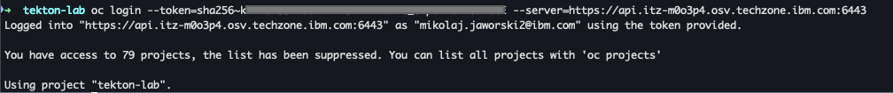
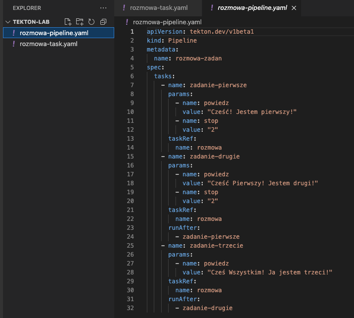

# Wstęp do Tektona

Tekton to wszechstronne, natywne narzędzie dla Kubernetes służące do tworzenia systemów ciągłej integracji i dostarczania (CI/CD). Podczas tego warsztatu, dowiesz się, jak:
- zainstalować Tekton (Pipelines) na OpenShift, 
- tworzyć Zadania (**Tasks**), oraz
- zbudować własny **Pipeline**.

## Wymagania wstępne

Aby wykonać laboratorium, należy:

1. Mieć dostęp do środowiska laboratoryjnego z OCP - instrukcje dostarcza prowadzący.

## Tasks - Wstęp

W tym ćwiczeniu dowiesz się jak:

1. Zainstalować Tektona z wykorzystaniem operatora.
2. Stworzyć swój pierwsz **Task** w konsoli OCP.
2. Zainicjować i uruchmomić **Task** z wykorzystniem `TaskRun`.
2. Dodać parametr do **Task**.

### Instalacja Tektona z wykorzystaniem Operatora

1.  Zaloguj się do konsoli OpenShift.

    a.  Otwórz przeglądarkę `Firefox`.

    b.  Kliknij zakładkę **`OpenShift Console`** na pasku narzędzi zakładek.

    c.  Dane logowania to:

    - Username: `ocadmin`

    - Password: `ibmrhocp`

2.  Zainstaluj **Red Hat OpenShift Pipelines** `Operator`.

    a.  Kliknij na **`Operators > OperatorHub`** w menu po lewej stronie.

    b. Wyszukaj `Pipelines`.

    

    c. Kliknij `Install`.

    d. Pozostaw wszystkie ustawienia domyślne i ponownie kliknij `Install`.

    e. Zaakceptuj instalację, klikając `Approve`.

    f. Poczekaj, aż moduł się zainstaluje i odśwież przeglądarkę.

    g. W pasku po lewej stronie pojawi się zakładka **Pipelines**.

    


### Stwórz swój pierwszy Task

**Task** w Tektonie to podstawowy element wykonawczy, który definiuje pojedyncze zadanie do wykonania w procesie CI/CD. Składa się z jednego lub więcej **Steps** (kroków), które są uruchamiane w kontenerach i wykonują konkretne polecenia, np. budowanie aplikacji, testowanie czy wdrażanie.

Aby sworzyć **Task**, mozesz wykorzystać zarówno CLI jak i konsole OCP. W tym laboratorium przetestujesz obie opcje.

1. W pierwszej kolejności utwórz nowy projekt (*namespace*):

   a.  Kliknij na **`Home > Projects`** w menu po lewej stronie.

   b. W prawym górnym roku kliknij `Create Project`.

   c. Nazwij go `tekton-lab` i kliknij `Create`.

2. Czas na pierwszy **Task**. Z panelu administratora rozwiń zakładkę `Pipelines`, a następnie kliknij `Tasks`.


4. Zmień projekt na `tekton-lab`.
5. Aby stworzyć swój pierwszy **Task**, kliknij `Create`, a następnie `Task`.


6. Pojawi się okno, gdzie możesz zdefiniować *Task*. Pierwszy Task, który stworzysz wykorzysta obraz `Red Hat Universal Base Image` i wykona komendę `echo`, aby się "przywitać". Wklej następującą definicję do okna i kliknij `Create`.

```yaml
apiVersion: tekton.dev/v1beta1
kind: Task
metadata:
  name: witaj
spec:
  steps:
    - name: powitanie
      image: registry.access.redhat.com/ubi8/ubi
      command:
        - /bin/bash
      args: ['-c', 'echo Witaj Tekton!']

```


Przyjrzyj się definicji powyżej. Typ obiektu to `Task`. Dalej defniujesz nazwę oraz poszczególne kroki (*Steps*) w ramach Task'u. Krok `powitanie` korzysta z obrazu UBI i wykonuje polecenie `echo` z odpowiednimi argumentami w konsoli `bash`.

### Inicjalizacja Task'u.

1. Aby zainicjalizować *Task*, należy stworzyć obiekt `TaskRun`. Kliknij `Create`, a następnie `TaskRun`.


2. Pojawi się okno w którym możesz zdefiniować *TaskRun*. Skopiuj definicję poniżej i wklej do konsoli OCP.

```yaml
apiVersion: tekton.dev/v1beta1
kind: TaskRun
metadata:
  name: witaj-run
spec:
  taskRef:
    name: witaj
```


3. Zaaplikuj `TaskRun`, klikając `Create`.
4. Zostaniesz przeniesiony do zainicjalizowanego `TaskRun` w konsoli OCP. Poczekaj, az `TaskRun` zakończy poprawnie pracę.


5. Zweryfikuj wykonanie komendy `echo`, przechodzać do zakładki `Logs`.


### Wykorzystanie parametrów w Task'u

1. Wróć do pulpitu `Tasks` i stwórz nowy **Task**, klikając `Create -> Task`.
2. W oknie wklej następującą definicję zadania:

```yaml
apiVersion: tekton.dev/v1beta1
kind: Task
metadata:
  name: witaj-param
spec:
  params:
    - name: osoba
      description: Imię osoby do powitania
      default: Programisto
      type: string
  steps:
    - name: powitanie-osoby
      image: registry.access.redhat.com/ubi8/ubi
      command:
        - /bin/bash
      args: ['-c', 'echo Witaj $(params.osoba)']
```


Bazując na naszym przykładzie `witaj`, dodałeś parametr `osoba` z domyślną wartością. Aby uzyskać dostęp do nowego parametru, należy wywołać go za pomocą konstrukcji `$(params.osoba)`

3. Wróc do puplitu `Tasks` i stwórz `TaskRun`, aby wywołać *Task*. Kliknij `Creat`, a następnie `TaskRun`.
4. Wklej definicję `TaskRun`:

```yaml
apiVersion: tekton.dev/v1beta1
kind: TaskRun
metadata:
  name: witaj-param-run
spec:
  params:
    - name: osoba
      value: "<Twoje imię>"
  taskRef:
    name: witaj-param
```


5. W `TaskRun` możesz nadpisać wartość paramentru zamieniając wartość w polu `value`. Kliknij `Create`, aby zainicjalizować wykonanie zdania.

6. Zweryfikuj wykonanie komendy `echo` po zakończeniu zadania, przechodzać do zakładki `Logs`.


## Pipeline - Wstęp

Teraz, gdy wiesz juz jak działają `Task'i` i parametry, przejdziesz do tworzenia `Pipeline`. Zadania (*Tasks*) są przeznaczone do pojedynczych działań, podczas gdy *Pipeline* to seria zadań, które mogą być uruchamiane równolegle lub sekwencyjnie.

W tym ćwiczeniu dowiesz się jak:

1. Stworzyć **Task** z wykorzystaniem CLI.
2. Stworzyć swój pierwsz **Pipeline** z wykorzystaniem CLI.
3. Zainicjować i uruchmomić **Pipeline** z wykorzystniem `PipelineRun`.

### Stwórz Task z wykorzystaniem CLI

1. Stwórz folder roboczy `tekton-lab` na swojej stacji roboczej.
1. Aby stworzyć Task z wykorzystaniem CLI w pierwszej kolejności musisz stworzyć plik `yaml` z definicją obiektu:

    a. Otwórz Terminal, a następnie stwórz folder `tekton-lab`. Wejdź do folderu, a następnie otwórz edytor tekstu.

    ```
    mkdir tekton-lab
    cd tekton-lab
    gedit rozmowa-task.yaml
    ```
3.  Wklej definicję `Tasku`:

```yaml
apiVersion: tekton.dev/v1beta1
kind: Task
metadata:
  name: rozmowa
spec:
  params:
    - name: powiedz
      description: Co powinienem powiedzieć?
      default: Witaj
      type: string
    - name: stop
      description: Jak długo czekać?
      default: 0
      type: string
  steps:
    - name: powiedz-to
      image: registry.access.redhat.com/ubi8/ubi
      command:
        - /bin/bash
      args: ['-c', 'sleep $(params.stop) && echo $(params.powiedz) && echo']
```


2. Przeanalizuj `Task` i zapisz go.
3. Teraz musisz się zalogować się do klastra OCP korzystając z CLI. Wróć do konsoli OCP i rozwiń nazwę swojego użytkownika, a następnie kliknij `Copy login command`.


4. Kliknij `Display Token`. W nowym oknie pojawi się komenda do logowania do klastra z CLI. Skopiuj ją.


5. Otwórz sesję terminala (`CMD`) na swojej stacji roboczej. 
6. Zmień folder roboczy na folder, gdzie zapisałś plik `rozmowa-task.yaml`. (Win: `dir '/<ściezka-do-TwójFolder>/tekton-lab` , Linux: `cd /<ściezka-do-TwójFolder>/tekton-lab`).
7. Wklej skopiowaną komendę logowania i kliknij `Enter`.



8. Zmień projekt na `tekton-lab` wpisując komendę: `oc project tekton-lab`


9. Aby stworzyć `Task` zaaplikuj plik `yaml` komendą: `oc apply -f rozmowa-task.yaml`


### Stwórz swój pierwszy Pipeline

1. Ponownie otwórz edytor i stwórz nowy plik o nazwie `rozmowa-pipeline.yaml`.

```
gedit rozmowa-pipeline.yaml
```

2. Wklej definicję `Pipeline`: 

```yaml
apiVersion: tekton.dev/v1beta1
kind: Pipeline
metadata:
  name: rozmowa-zadan
spec:
  tasks:
    - name: zadanie-pierwsze
      params:
        - name: powiedz
          value: "Cześć! Jestem pierwszy!"
        - name: stop
          value: "2"
      taskRef:
        name: rozmowa
    - name: zadanie-drugie
      params:
        - name: powiedz
          value: "Cześć Pierwszy! Jestem drugi!"
        - name: stop
          value: "2"
      taskRef:
        name: rozmowa
      runAfter:
        - zadanie-pierwsze
    - name: zadanie-trzecie
      params:
        - name: powiedz
          value: "Cześ Wszystkim! Ja jestem trzeci!"
      taskRef:
        name: rozmowa
      runAfter:
        - zadanie-drugie
```

Przyjrzyj się definicji powyżej. Typ obiektu to `Pipeline`. Dalej defniujesz nazwę, a następnie zadania (`Tasks`), które mają być wykonane. Dla poszczególnych zadań definiujesz nazwę zadania (`name`), parametry zadania (`params`) oraz definicje zadania (`taskRef`). Jeśli chcesz, aby zadania wykonywały się sekwencyjne należy dodać parametr `runAfter`, który definiuje po którym zadaniu ma się wykonać dany Task. Bez tego parametru zadania będą wykonywać się równolegle. 



3. Aby stworzyć `Pipeline` zaaplikuj plik `yaml` komendą: `oc apply -f rozmowa-pipeline.yaml`


4. W następnym kroku należy stworzyć obiekt `PipelineRun`, który analogicznie jak `TaskRun` wykonuje `Pipeline`. Otwórz edytor i stwórz nowy plik o nazwie `rozmowa-pipeline-run.yaml`.
5. Wklej definicję `PipelineRun`:

```yaml
apiVersion: tekton.dev/v1beta1
kind: PipelineRun
metadata:
  name: rozmowa-zadan-run
spec:
  pipelineRef:
    name: rozmowa-zadan
```


6. Aby uruchomić `Pipeline` zaaplikuj plik `rozmowa-pipeline-run.yaml` komendą: `oc apply -f rozmowa-pipeline-run.yaml`


7. Aby sprawdzić logi wykonanego Pipeline'u wróć do konsoli OCP i przejdź do pulpitu `Pipelines` i kliknij `rozmowa-zadan-run`.


8. Wszystkie zadania wykonały się w odpowiedniej sekwencji i zakończyły sukcesem. Przejdź do zakładki `Logs`.


9. Przejrzyj wykonanie poszczególnych zadań.

